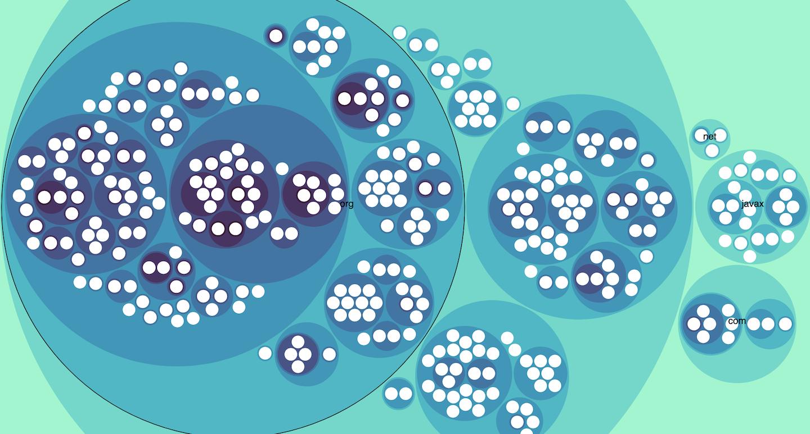
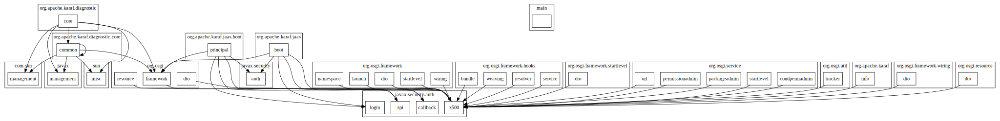
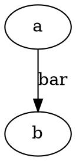

# Going Merry

> a legacy Java system build migration toolbox, support ant to maven, find lost dep in nexus...


[](https://travis-ci.org/phodal/merry)
[](https://codecov.io/gh/phodal/merry)

[](https://codeclimate.com/github/phodal/merry/maintainability)

Refactor Tool -> [Coca](https://github.com/phodal/coca)

Online Example for Call Analysis: [https://phodal.github.io/merry/demo](https://phodal.github.io/merry/demo)

Online Screenshots:



Feature lists:

```bash
Available Commands:
  boom        generate pom.xml from build.xml
  call        show call graph for packages
  checksum    checksum file md5
  dupsearch   build maven pom from all jars file
  fix         fix jar naming issue
  help        Help about any command
  manifest    manifest query & map tools
  map         generate map.csv from jar
  pom         generate pom file from jar file
  version     version

```

## Usage

1. install

```bash
go get -u github.com/phodal/merry
```

2. generate `pom.xml` from `build.xml`

```bash
merry boom
```

3. search package lost in nexus

```bash
merry dupsearch
```

4. map file example

format: `{origin},{GroupId},{ArtifactId},{VersionId}`

```
origin,groupid,artifactId,version
org.springframework.transaction,org.springframework,transaction.org.springframework.transaction,2.5.6.SEC01
javax.servlet,javax.servlet,javax.servlet,2.4.0
edu.emory.mathcs.backport.java.util,edu.emory.mathcs.backport,com.springsource.edu.emory.mathcs.backport,3.1.0
edu.emory.mathcs.backport.java.util.concurrent,edu.emory.mathcs.backport,com.springsource.edu.emory.mathcs.backport,3.1.0
edu.emory.mathcs.backport.java.util.concurrent.atomic,edu.emory.mathcs.backport,com.springsource.edu.emory.mathcs.backport,3.1.0
edu.emory.mathcs.backport.java.util.concurrent.helpers,edu.emory.mathcs.backport,com.springsource.edu.emory.mathcs.backport,3.1.0
edu.emory.mathcs.backport.java.util.concurrent.locks,edu.emory.mathcs.backport,com.springsource.edu.emory.mathcs.backport,3.1.0
org.apache.commons.dbcp,org.apache.commons,com.springsource.org.apache.commons.dbcp,1.2.2.osgi
org.apache.commons.logging,commons-logging,commons-logging,1.1.1
org.slf4j,org.slf4j,org.slf4j,1.5.1
```

### Manifest

```bash
Usage:
  merry manifest [flags]

Flags:
  -e, --excludeSource   is with exclude source file
  -x, --extract         extract manifest file from jar
  -f, --filter string   filter
  -h, --help            help for manifest
  -m, --merge           is merge package
  -p, --path string     path (default ".")
  -s, --scan            scan manifest file to graphviz
  -v, --version         show manifest version info of jar
```

examples:

```bash
merry manifest -s -x -f org.eclipse.equinox -p ~/sdk/equinox-SDK-4.15/plugins
```

### Generate Pom from jars

```bash
merry pom -p _fixtures/demo -m _fixtures/map/map.csv
```

### Call Graph by Manifest.MF

```bash
Flags:
  -h, --help          help for call
  -m, --map string    map file
  -p, --path string   path (default ".")
  -s, --server        with server
```

full steps:

```bash
merry manifest -s -p ~/sdk/apache-karaf-4.2.9/lib/boot  -x
merry map -p ~/sdk/apache-karaf-4.2.9/lib/boot
merry call -p ~/sdk/apache-karaf-4.2.9/lib/boot -m map.csv
```

results:



show only one line with `strict`



#### Call Server

cmd: `merry call -s`

`merry` will read `manifest-map.json` and start to [http://localhost:3000](http://localhost:3000):

example: [https://phodal.github.io/merry/demo](https://phodal.github.io/merry/demo)

## Todo

Todo:

 - [x] Ant to Maven
    - [x] dependencies convert
    - [x] Checksum File
    - [x] Unzip file
    - [x] Parse Manifest
 - [x] Dup Search. search all jars and find not in nexus package
 - [x] POM generate dep graph
    - [x] basic graph
    - [x] go server
    - [x] visual with circle [Hierarchical Edge Bundling](https://observablehq.com/@d3/hierarchical-edge-bundling)
 - [x] jar auto rename
   - [x] use POM rename jar
 - [x] custom version
   - [x] configurable
   - [x] from jar to map.csv

License
---

@ 2020 A [Phodal Huang](https://www.phodal.com)'s [Idea](http://github.com/phodal/ideas).  This code is distributed under the MPL license. See `LICENSE` in this directory.
